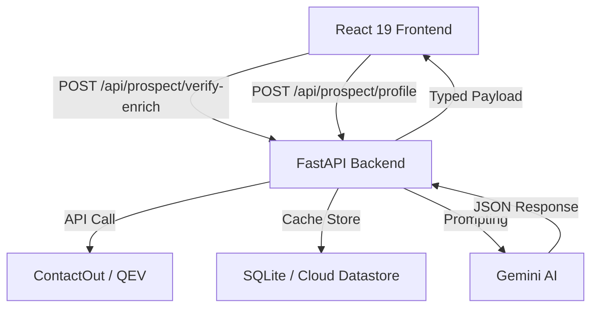

# 🚀 Prospect Radar: Full-Stack Sales Intelligence

The **Prospect Radar** is a sales intelligence engine that transforms raw lead data into actionable, AI-powered insights. By defining a **Seller Context** (your product, your size, your targets) and entering a prospect's email, the platform uses **ContactOut** for deterministic data enrichment and **Gemini AI** for high-fidelity deal strategy synthesis.

---

## 🏗️ System Architecture



---

## 💻 Local Setup

### 1. Backend (Python + FastAPI)
Requires **Python 3.10+** and a virtual environment.

```bash
cd backend
python3 -m venv venv
source venv/bin/activate
pip install -r requirements.txt

# Create environment file from example
cp .env.example .env

# Run server
uvicorn main:app --reload --port 8000
```
- **API URL**: [http://localhost:8000](http://localhost:8000)
- **Docs**: [http://localhost:8000/docs](http://localhost:8000/docs)

### 2. Frontend (React + Vite)
Requires **Node.js 18+**.

```bash
cd frontend
npm install
npm run dev -- --port 5173
```
- **Dashboard**: [http://localhost:5173](http://localhost:5173)

---

## 🔑 Environment Variables

The backend requires a `.env` file in the `backend/` directory with the following keys:

| Key | Description |
| --- | --- |
| `GEMINI_API_KEY` | Your Google AI SDK key (required for LLM insights). |
| `CONTACTOUT_API_KEY` | ContactOut Search API key for prospect enrichment. |
| `QUICKEMAILVERIFICATION_API_KEY` | Optional. Used for email deliverability checks. |
| `CACHE_MODE` | `SQLITE` (Local) or `GCP_DATASTORE` (Production). |

---

## 🛠 Tech Stack

- **Frontend**: React 19, TypeScript, Tailwind CSS, Vite 7, Radix UI.
- **Backend**: Python 3, FastAPI, Pydantic, HTTPX, Uvicorn.
- **Intelligence**: Gemini Pro 1.5/Flash, ContactOut API Integration.
- **Persistence**: SQLite (Local Cache), Cloud Datastore (Cloud Mode).

---

## � Documentation Reference

Detailed architectural and design spec files are available in the [docs/](./docs) folder:

- [**High-Level Architecture**](./docs/DASHBOARD_ARCHITECTURE.md): System design & prompt patterns.
- [**Folder Manifesto**](./docs/FOLDER.md): Full directory structure and file purposes.
- [**Design System & UX**](./docs/COLORS_UX.md): Visual tokens, colors, and layout rules.
- [**Engineering Standards**](./docs/RULES.md): Formatting and code generation guidelines.

---

## 📄 License
Private — Proprietary Internal Development.
