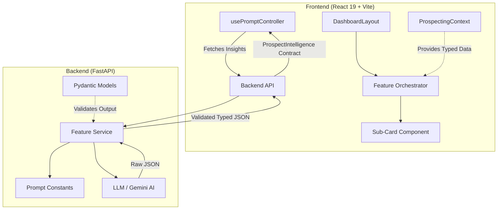

# Dashboard Architecture — High-Level System Design

> This document describes the overall architecture, data flow, and design principles of the **Prospect Radar**.

---

## System Overview

The application follows a decoupled **Client-Server Orchestrator** pattern.

---

## Data Layer & Contracts

### 🏷️ The Contract System (SSoT)
We maintain strictly mirrored models between the Backend (Pydantic) and the Frontend (TypeScript). This ensures end-to-end type safety and allows the LLM to output data that exactly matches the UI's expectations.

| File (Frontend) | Responsibility |
| :--- | :--- |
| `src/contracts/base.ts` | Shared types (Identity, Organization, Seller Context). |
| `src/contracts/profile.ts` | Profile-tab specific metrics and news insights. |
| `src/contracts/index.ts` | The composed `ProspectIntelligence` root type. |

### 🛠️ Backend Intelligence
| Module | Role |
| :--- | :--- |
| `backend/main.py` | API Entry point & middleware. |
| `backend/features/` | Per-tab logic (Prompts, Services, Sub-contracts). |
| `backend/features/shared/contracts.py` | Pydantic definitions for all contracts. |

---

## Rendering Layer (Frontend)

### 1. Feature Orchestrators (`src/features/`)
Each stage of the dashboard (Profile, Power, Pain, Path) lives in its own feature directory. The top-level component (e.g., `ProfileStage.tsx`) is a **pure layout orchestrator** — it only arranges cards into grids and passes them typed data from the context.

### 2. Global Context (`src/context/`)
The `ProspectingContext.tsx` handles the "Single Source of Truth". It stores the enriched `identity` and `organization` data, as well as the lazy-loaded `insights` for each tab.

### 3. Prompt Controller (`src/hooks/`)
The `usePromptController` hook manages the asynchronous state of AI requests. It ensures that clicking a tab triggers the corresponding LLM call only if the data isn't already present in the SSoT.

---

## Architecture Principles

1. **Modular Contracts** — One file per tab. Small, focused, and globally composed.
2. **One Card = One File** — Every visual card has its own `.tsx` file in the feature's `components/` folder.
3. **Mirrored Models** — Backend Pydantic classes and Frontend TS interfaces must stay in sync.
4. **Lazy-Loading Insights** — We only ask the AI for the analysis the user is currently viewing.
5. **No Dead Code** — If it's not on screen, it shouldn't be in the repo.

---

## Quick Reference: Where to Find Things

*   **To change a UI card on a page**: → `src/features/{feature-name}/components/{CardName}.tsx`
*   **To change the AI's instruction**: → `backend/features/{feature-name}/` or the `/prompts/` repository.
*   **To update a data interface**: → `frontend/src/contracts/` AND `backend/features/shared/contracts.py`.
*   **To adjust global colors/spacing**: → `src/lib/theme.ts` AND `tailwind.config.js`.
